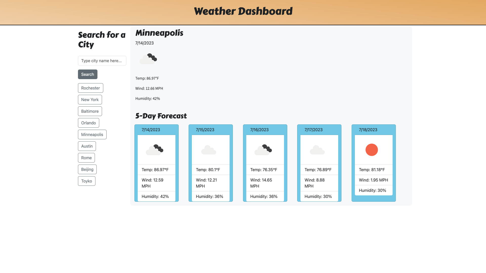

# Weather Dashboard (Module 06 Homework - Server Side APIs)

The goal was to create a Weather App to show travelers current and future weather conditions of different cities. The requirements were:
- The webpage is a dashboard with form inputs
- Searching for a city will display current and future weather conditions for that city
- Searching for a city will save that city to the search history
- Current weather conditions include the city name, the date, an weather icon, the temperature, the humidity, and the wind speed
- Future weather conditions will show a 5-day forecast with the same conditions as the current weather display
- When the user clicks on a city in the search history, they will again see the conditions for that city

 

## Visual Example

---

 

## Working Version

---

[Link to Deployed Version](https://a-down.github.io/weather-dashboard/)